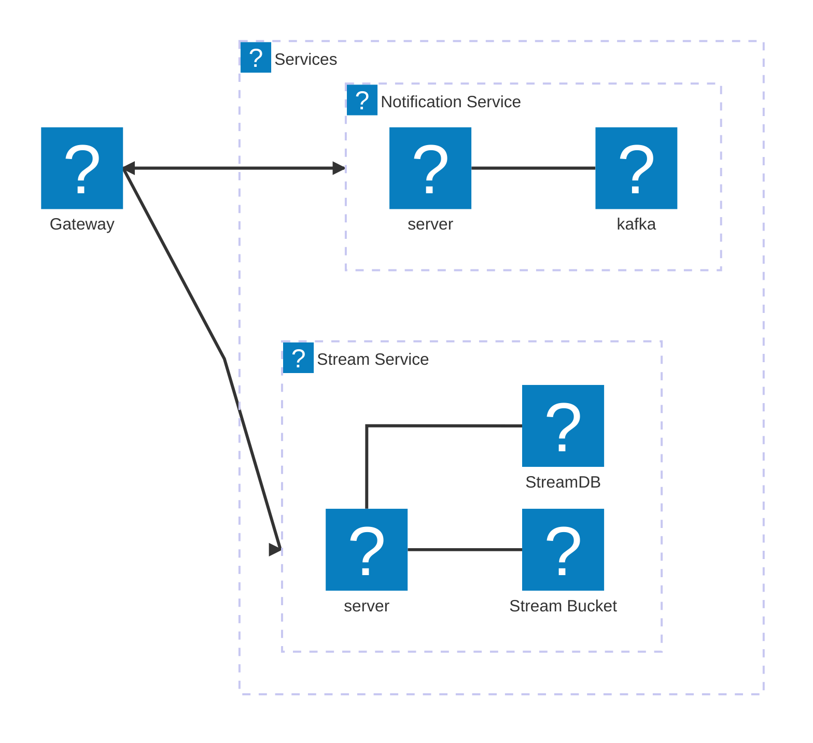

# twitch-clone-microservices

```mermaid
---
title: Twitch Clone Microservices
config:
  
---

architecture-beta
    service gateway(logos:graphql)[Gateway]
    
    group services(logos:grpc)[Services]

    group stream_service(logos:docker)[Stream Service] in services
    service stream_server(logos:go) [server] in stream_service
    service stream_db(logos:postgresql) [StreamDB] in stream_service
    service stream_bucket(logos:aws-s3) [Stream Bucket] in stream_service
    stream_server:T -- L:stream_db
    stream_server:R -- L:stream_bucket

    group notification_service(logos:docker)[Notification Service] in services
    service notification_server(logos:nestjs) [server] in notification_service
    service notification_kafka(logos:kafka) [kafka] in notification_service

    notification_server:R -- L:notification_kafka


    

    gateway:R <--> L:stream_server{group}
    gateway:R <--> L:notification_server{group}
```