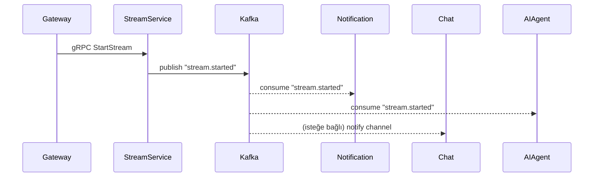

# STREAM SERVICE (GO)

```mermaid
sequenceDiagram
    participant Gateway
    participant StreamService
    participant Kafka
    participant Notification
    participant Chat
    participant AIAgent

    Gateway->>StreamService: gRPC StartStream
    StreamService->>Kafka: publish "stream.started"
    Kafka-->>Notification: consume "stream.started"
    Kafka-->>AIAgent: consume "stream.started"
    Kafka-->>Chat: (isteğe bağlı) notify channel

```
